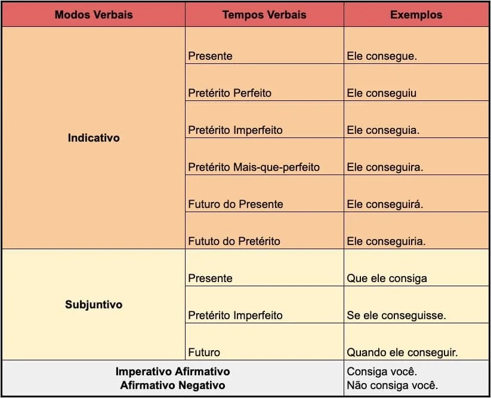

# ***Table of Contents*** <!-- omit in toc -->
- [**Fonologia:**](#fonologia)
- [**Morfologia:**](#morfologia)
- [**Sintaxe:**](#sintaxe)
- [**Semântica:**](#semântica)
- [Terminologia Linguística:](#terminologia-linguística)

## **Fonologia:** 

### Encontros Vocálicos

São sequências de vogais na mesma palavra. Existem três tipos:

- **Semivogal:** A semivogais **não são pronunciadas com tanta intensidade como as vogais**. Geralmente, são as letras **“i”** e **“u”** que assumem a função de semivogais.

**Hiato:** Duas vogais em sílabas diferentes.

> álc**oo**l (ál-co-ol)
> nav**io** (na-vi-o)
> s**aí**da (sa-í-da)

**Ditongo:** `(Duas vogais)` Uma vogal com uma semivogal na mesma sílaba.

> pap**ai** (pa-pai)
> **oi** (a palavra "oi" não se separa)
> sab**ão** (sa-bão)

**Tritongo:** `(Três vogais)` Na mesma sílaba, uma vogal entre duas semivogais.

> iguais (i-guais)
> saguão (sa-guão)
> uruguaio (u-ru-guai-o).

---

### Dígrafos

São grupos de duas letras que representam um único som, como "ch" em "chave" ou "lh" em "olho". Podem ser consonantais (como "nh" e "rr") ou vocálicos (como "em" em "trem").

---

### Prosódia:

Estuda a entonação, o ritmo e a acentuação na fala. A prosódia é importante para entender como a ênfase em certas sílabas ou palavras pode mudar o sentido ou a clareza do que é dito.

---

### Acentuação:

Refere-se às regras que determinam onde colocar os acentos gráficos (agudo, circunflexo, etc.) nas palavras. Isso inclui entender os tipos de acentos, as palavras oxítonas, paroxítonas e proparoxítonas, e as exceções às regras gerais.

---

### Ortografia:

Envolve as regras de escrita de uma língua, como o uso correto das letras, acentuação, e o emprego de maiúsculas e minúsculas. A ortografia também abrange as regras de grafia dos dígrafos e dos encontros vocálicos.

---
---

## **Morfologia:**

[Resumo Noslen](https://www.youtube.com/watch?v=bWtHILzAMUk&ab_channel=ProfessorNoslen)

### Estrutura e Formação das Palavras:

A morfologia estuda a estrutura das palavras, que é composta por radical, prefixo, sufixo, e outros elementos como desinências e vogais temáticas.

**Radical:** A parte central da palavra, que nao muda.

> **Cert**o
> **Cert**amente
> **Cert**eza

- **Vogal Temática:** Vogal que se junta ao radical para formar o tema da palavra.

> Cert**o**
> Cert**a**mente
> Cert**e**za

> Juntos eles formam o Tema (Radical = V.Temática = Tema)

---

#### Afixos:
**Prefixo:** Elemento que se adiciona antes do radical para modificar seu significado.
  
> **A**certo
> **Des**fazer

**Sufixo:** Elemento que se adiciona após o radical.
  
> Cert**eza**
> Feliz**mente**

---

#### Desinência:
Elemento que se adiciona ao final das palavras, indicando suas [flexões](#flexões). Existem dois tipos principais de desinências:

**Desinência Nominal:** Indica flexões de gênero e número.
> Menino**s**
> Garot**a**
> Certo**s**
> Cert**as**

**Desinência Verbal:** Indica flexões de número, pessoa, tempo e modo nos verbos.

> Canta**va**
> Fal**ei**
> Viv**e**

- **Flexões:** São modificações que a palavra sofre para concordar com outras palavras na frase. Elas podem ser:

  - **Flexão Verbal:**  
    - **Número:** Singular/Plural  
    - **Tempo:** Passado/Presente/Futuro  
    - **Modo:** Indicativo/Subjuntivo/Imperativo  
    - **Pessoa:** Primeira/Segunda/Terceira pessoa
    
  - **Flexão Nominal:**  
    - **Gênero:** Masculino/Feminino  
    - **Número:** Singular/Plural

---

### Formação de Palavras: 

**Por Derivação:** Apenas 1 radical adicionando afixos

> Acerto
> Certo
> Certamente

- **Derivação Parassintético** Acrecimo de um prefixo e um sufixo, caso um seja removido há a perda de sentido.
  
> **En** + tarde + **ecer**
> Tardecer ou Entarde (não fazem sentido)

- **Derivação Regressiva** Alerar a classe da palavra pela redução da palavra primitiva(nao entendi exatamente)

>chorar (verbo) → choro(substantivo)
  
- **Derivação Impropria** Há alteração na classe da palavra sem a alteração na sua forma

> jantar(verbo) → o jantar(substantivo)

**Por Composição:** 2 ou mais radicais formando novas palavras

> Guarda-Sol
> Passatempo
> Pernilongo
> Agridoce

- **Vogal de ligação & Consoante de ligação:** Elementos para facilitar a pronuncia
  
> Mar**e**sia
> Gas**ô**metro
> Cafe**t**eira
> Pau**l**ada

- **Justaposição e Aglutinação** 
  - **Composição por justaposição:** as palavras são formadas pela união de dois ou mais radicais, sem apresentar alterações nos seus sons
  > cachorro-quente (cachorro + quente)
  > pé-de-meia (pé + de + meia)
  > passatempo (passa + tempo)
  > guarda-chuva (guarda + chuva)
  > pontapé (ponta + pé)

  - **Composição por aglutinação:** as palavras são formadas pela união de dois ou mais radicais, mas sofrem alterações.
  > vinagre (vinho + acre)
  > planalto (plano + alto)
  > embora (em + boa + hora)
  > fidalgo (filho + de + algo)
  > aguardente (água + ardente)

[Derivação x Composição - Professor Noslen](https://www.youtube.com/watch?v=9v207JMiOKs&ab_channel=ProfessorNoslen)

---

### Classes de Palavras:

- **Substantivo:** Nomeia seres, coisas, lugares, etc.  
  > casa  
  > carro  
  > cidade

- **Adjetivo:** Qualifica ou caracteriza o substantivo.  
  > belo  
  > grande  
  > rápido

- **Verbo:** Indica ação, estado ou fenômeno da natureza.  
  > correr  
  > estar  
  > chover

- **Advérbio:** Modifica o verbo, adjetivo ou outro advérbio, indicando circunstâncias como tempo, lugar, modo, etc.  
  > rapidamente  
  > longe  
  > sempre

- **Pronome:** Substitui ou acompanha o substantivo.  
  > ele  
  > nós  
  > meu

- **Artigo:** Define ou limita o substantivo, indicando o gênero e o número.
  > o
  > a
  > os

- **Numeral:** Indica a quantidade ou a ordem de seres.  
  > um  
  > dois  
  > primeiro

- **Preposição:** Relaciona palavras, estabelecendo dependência entre elas.  
  > de  
  > em  
  > com

- **Conjunção:** Liga orações ou palavras de mesma função.  
  > e  
  > mas  
  > porque

- **Interjeição:** Expressa emoções ou reações.  
  > Oh!  
  > Ai!  
  > Ufa!

---

### **Exemplos:**

*"Oh! Ela correu rapidamente para a casa grande, porque seu amigo estava esperando por ela no portão com dois cachorros."*

> **Substantivo:** casa, amigo, portão, cachorros  
> **Adjetivo:** grande  
> **Verbo:** correu, estava, esperando  
> **Advérbio:** rapidamente  
> **Pronome:** ela, seu  
> **Artigo:** a  
> **Numeral:** dois
> **Preposição:** para, por, no (em + o)  
> **Conjunção:** porque  
> **Interjeição:** Oh!  

---
---

## **Sintaxe:**

[***Exercícios-1***](https://www.todamateria.com.br/exercicios-de-analise-sintatica/)

### Estrutura da Frase/Oração/Período:

**Resumo:**
- **Frase** é um enunciado de sentido completo e pode ser formada por uma ou mais palavras.
- **Oração** é uma frase que contém um verbo ([locução verbal](#locução-verbal)).
- **Período** é uma frase formada por uma ou mais orações, podendo ser simples ou composto.

#### Frase:

*Frase é um emaranhado de palavras com sentido completo, que não necessariamente precisa ter um verbo para ter sentido.*

**Frase Nominal:** Frase formada sem a presença de um verbo.
> Que dia bonito!

**Frase Verbal:** Frase formada com a presença de um verbo.
> Ele **correu** para o trabalho.

#### Oração:

*Oração é toda construção linguística que contém um verbo ou uma locução verbal. , dentro de uma frase podemos ter uma ou mais orações.*

##### *Locução verbal*:
Dois ou mais verbos com o valor de um:

- **Verbo Auxiliar + Verbo Principal:**
> **Vou comprar** o bolo...
>  Ela **tem** sido** vista com o...
>  Ele **veio resolver** o...

**Verbos auxiliares comuns:** ser, estar, ter, haver, etc.

#### Período:

Período é uma frase formada por uma ou mais orações.

**Período Simples:** Contém apenas uma oração.
> A chuva **caiu** forte.

**Período Composto:** Contém mais de uma oração.
> Se você **terminar** o trabalho, **podemos** sair.

---

### Termos Essenciais:

#### Sujeito:
É o termo da oração que realiza ou sofre a ação verbal.

`Sempre perguntar ao verbo, quem ou o que para achar o sujeito`

**Sujeito Simples:** Possui apenas um núcleo.
> **Ele** correu para o trabalho.

**Sujeito Composto:** Possui mais de um núcleo.
> **João e Maria** foram ao mercado.

**Sujeito Oculto:** Não está explícito na oração, mas é identificado pelo contexto.
> **Fomos** ao cinema ontem. (***Nós***)

**Sujeito Indeterminado:** Não se refere a um ser específico.
> **Falaram** sobre o evento. (Verbo na 3.ª pessoa do plural) (Eles, Vocês...)

`Tenta colocar "Vocês" e "Eles", se a frase continuar fazendo sentido, é provável que o sujeito seja indeterminado.`

---

#### Predicado: 

Declarar algo sobre o sujeito ou simplesmente declarar algo.

**Predicado Verbal:** Predicado cujo núcleo é um verbo de ação.
> Ela **correu rapidamente**. (**correu** é o verbo de ação e rapidamente é adverbio de modo)

**Predicado Nominal:** Predicado que atribui uma característica ao sujeito através de um verbo de ligação.
> O livro **é interessante**.

**Predicado Verbo-Nominal:** Combina um verbo de ação e uma característica do sujeito ou objeto.
> A música **cativou ouvintes <u>de todas as idades</u>**. (**cativou** é o verbo de ação, de todas as idades é o adjunto adnominal)
> Ela **correu cansada.** (**correu** é o verbo de ação, e "cansada" é um adjetivo do sujeito)

---

### Termos Integrantes:

#### Complementos Verbal:

**Complemento Verbal**: Completa o sentido de verbos, pode ser objeto direto ou indireto.

- **Objeto Direto:** Completa o sentido de um <u>[verbo transitivo direto](#verbos-transitivos-direto-indireto-e-intransitivovtd--vti)</u>, sem preposição.
> Eu <u>comprei</u> **um carro**.

- **Objeto Indireto:** Completa o sentido de um <u>[verbo transitivo indireto](#verbos-transitivos-direto-indireto-e-intransitivovtd--vti)</u>, com preposição.
> Ela <u>precisa</u> **de ajuda**.
> Eu <u>gosto</u> **de musica**

##### Verbos Transitivos direto ,indireto e intransitivo(VTD & VTI):
Quando se deparar com um verbo, faça perguntas a ele:

  - **O que?** (verbos transitivos **diretos**)
  - **De que? ou A quem?** (verbos transitivos **indiretos**)
  
  > Raissa **Comprou** o livro (Raissa comprou o que?)
  > Raissa **respondeu** ao professor (Raissa respondeu a quem? ou ao que? )

  O verbo intransitivo é aquele que não necessita de complemento, pois seu sentido é completo por si só.
  > Vovó **morreu.** 

#### Complementos Nominal:
Completa o sentido de um substantivo, adjetivo ou advérbio.

> Ele tem interesse **em viajar**. (**em viajar** completa o sentido do substantivo interesse)
> Faça bom proveito **das férias**. (**das férias** completa o sentido do substantivo proveito.)
> Ele está interessado **em aprender**. (**em aprender** é o complemento nominal que completa o sentido do adjetivo interessado)
> A escola fica perto **da minha casa**. (**da minha casa** é o complemento nominal que completa o sentido do advérbio perto.)

#### Agente da Passiva
Indica quem executa a ação sobre o sujeito na voz passiva.

> O prêmio foi recebido **pelo representante** da equipe. (**pelo representante** está indicando quem recebeu o prêmio.)

---

### Termos Acessórios:

**Adjunto Adnominal:** Qualifica ou especifica um substantivo.
> O carro **azul** é rápido.

**Adjunto Adverbial:** Modifica o verbo, indicando circunstâncias como tempo, lugar, modo, etc.
> Ele estudou **ontem à noite.**

**Aposto:** Explica, especifica ou amplia o significado de um termo anterior.
> Carlos, **o médico**, chegou tarde.

**Vocativo:** Termo usado para chamar ou interpelar alguém.
> Maria, venha aqui!

---

### **Exemplos:**

*A música cativou ouvintes de todas as idades.*

> **Sujeito Simples:** a música
> **Predicado Verbal:** cativou ouvintes de todas as idades
> **Verbo Transitivo:** cativou
> **Objeto Direto:** ouvintes
> **Adjunto Adnominal:** de todas as idades (caracteriza "ouvintes")

*Eu comprei um livro interessante ontem para minha amiga que estava esperando na livraria.*

> **Sujeito:** Eu
> **Predicado Verbal:** comprei um livro interessante ontem
> **Objeto Direto:** um livro interessante
> **Objeto Indireto:** para minha amiga
> **Adjunto Adnominal:** interessante
> **Adjunto Adverbial:** ontem

---
---

## **Semântica:**

## Terminologia Linguística:

[Nominal:](#classes-de-palavras) Relacionado a substantivos e adjetivos.
[Verbal:](#classes-de-palavras) Relacionado a verbos.
Composto:

[Subjuntivo:]() exprime desejos, possibilidades, dúvidas.
> *Talvez discurse bem esta noite.*

[Indicativo:]() exprime fatos, certezas.
> *Discursa muito bem.*

[Imperativo:]() exprime ordens, pedidos. 
> *Discurse como ele!*

Só há hífen após "mal" quando a palavra seguinte se inicia por vogal, por "h" ou por "l".
