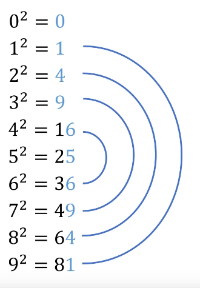

# Expoente

## Quadrado de 5

Multiplica os dígitos que vem antes do 5 pelo proximo digito que viria.

Adicione  o resultado da multiplicação, seguido de 25 na posição finals.

### Ex:

$15^2$

    1*2 = 2
    15^2 = 225

$65^2$

    6*7 = 42
    65^2 = 4225

$445^2$

    44*45 = 1980
    445^2 = 198025

# Raiz Quadrada

[*How To Calculate Square Roots*](https://www.youtube.com/watch?v=I7TFYa1v9xI&ab_channel=MindYourDecisions)

Para Números grandes tenha em mente que:

$0^2$ = 0

$1^2$ = 1

$2^2$ = 4

$3^2$ = 9

$4^2$ = 1**6**

$5^2$ = 2**5**

$6^2$ = 3**6**

$7^2$ = 4**9**

$8^2$ = 6**4**

$9^2$ = 8**1**

## Formula
$\sqrt{1600}$

Vamos quebrar este numero em 2 partes de 2 digitos.
1600, vira 16 e 00.

Pegamos a ultima parte (00), temos que ela é terminada em 0, logo o quadrado mais proximo é 0.

| Último dígito do número | Último dígito do quadrado |
|---|---|
| 0 | 0 |
| 1 | 1 ou 9 |
| 4 | 2 ou 8 |
| 5 | 5 |
| 6 | 4 ou 6 |
| 9 | 3 ou 7 |

Já a primeira parte (16), temos que procurar o numero igual ou menor nos quadrados. Nesse caso $4^2$ da o resultado que estamos procurando.

Sendo assim podemos dizer que:
$\sqrt{1600} = 40$ 

---

$\sqrt{4225}$

Usamos a mesma logica.

O ultimo digito da segunda parte(25) é 5, o quadrado mais proximo é 5.

Já na primeira (42) o quadrado mais proximo(<) é 6 $6^2$ (36)

Sendo assim podemos dizer que:

$\sqrt{4225} = 65$ 

---

Indo para outro exemplo mais complicado

$\sqrt{3969}$

O primeiro quadrado ja pode ser dito que é **6**.

Porem na segunda parte (69) é terminada em 9, que tem os quadrados 3 e 7 terminados em 9.

Sendo assim a resposta pode ser tanto 63 quanto 67.

Para tirarmos essa duvida vamos ver o resultado de $65^2$. Que nos dirá qual é a resposta correta.

$65^2$

    6*7 = 42
    65^2 = 4225

4225 < 3969 , sendo assim a resposta **não pode ser 67**, que daria um numero ainda maior.
Sobrando **63**.

$\sqrt{3969} = 63$

---
O video, fala sobre exemplos que nao foram ditos aqui, como $\sqrt{16384}$, por volta do minuto 6:47.

Que em resumo, usa 3 dígitos no primeiro grupo ao invés de 2.

E tamvem fala sobre a "Raiz Cubica" por volta do minuto 7:34.

[*How To Calculate Square Roots*](https://www.youtube.com/watch?v=I7TFYa1v9xI&ab_channel=MindYourDecisions)

P.S.: Verificar se tem formula para numeros terminado em 2,3,7.
