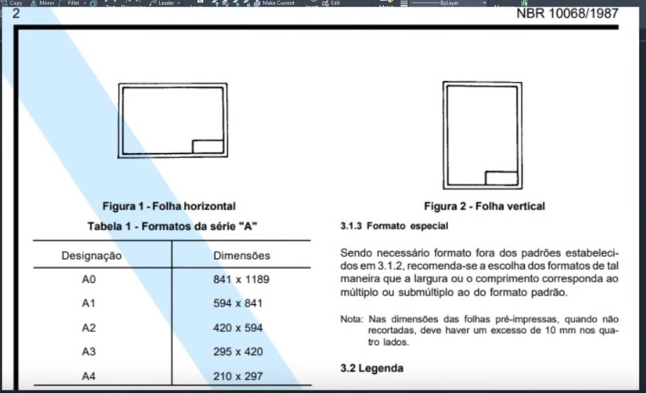
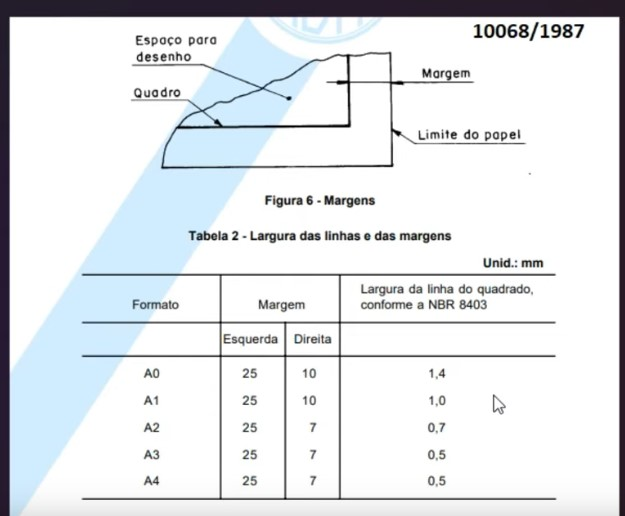
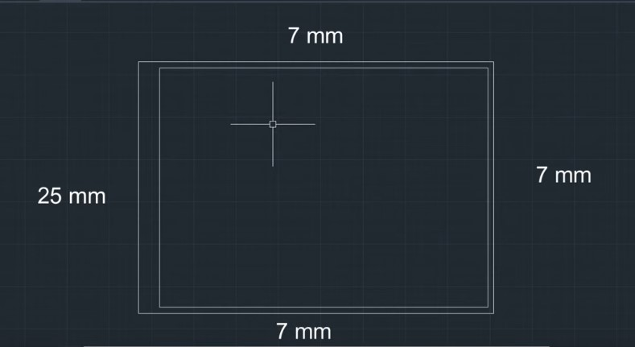
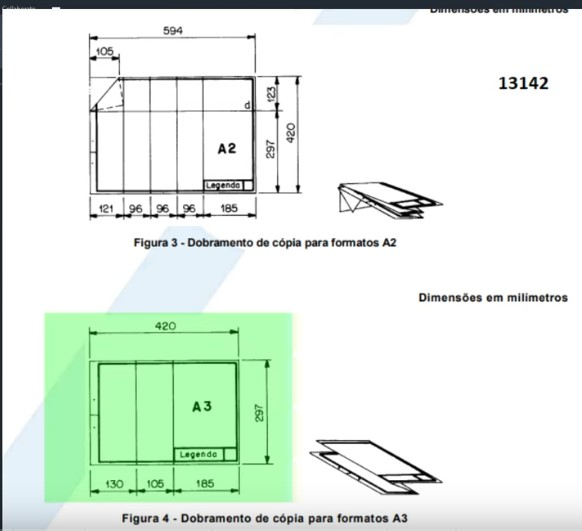
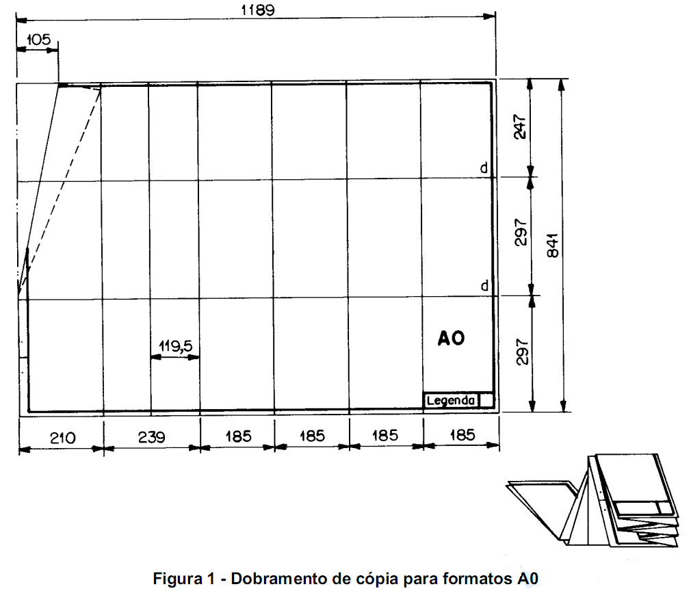
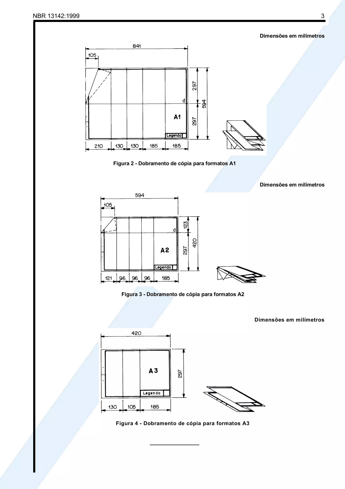
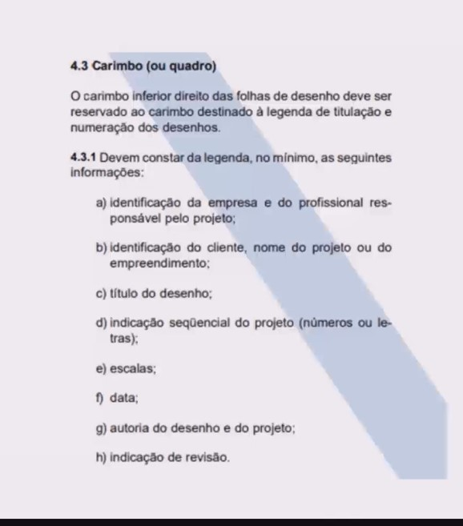
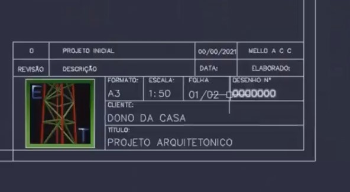
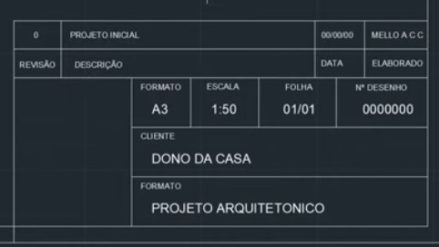

[Video de Tutorial](https://www.youtube.com/watch?app=desktop&v=uXfLH4ywT5A&ab_channel=EngenhariaeTecnologia)

Adaptar conforme a norma ABNT atual
[ABNT NBR 17170:2022](../../PDFs/Tools/ABNT_NBR_17170_2022-Garantias.pdf)

---
# Montando a Prancha
*O Texto foi escrito com base na **NBR 10068/1987** e **[Norma ABNT NBR 6492](NoteBooks/PDFs/Tools/NBR_6492_2021.pdf)*** 

## Escolhendo escala:

## Tamanho Padrão da Prancha
- **A0**: 841 mm x 1189 mm
- **A1**: 594 mm x 841 mm
- **A2**: 420 mm x 594 mm
- **A3**: 297 mm x 420 mm (Esta errado na norma)
- **A4**: 210 mm x 297 mm

# Dimensões das Margens

| Formato | Margem (Esquerda) | Margem (Direita) | Largura da Linha do Quadrado |
|---------|--------------------|-------------------|------------------------------|
| A0      | 25 mm              | 10 mm             | 1,4 mm                       |
| A1      | 25 mm              | 10 mm             | 1,0 mm                       |
| A2      | 25 mm              | 7 mm              | 0,7 mm                       |
| A3      | 25 mm              | 7 mm              | 0,5 mm                       |
| A4      | 25 mm              | 7 mm              | 0,5 mm                       |

## Dobras (NBR 13142):

As dobras devem seguir as indicações das figuras 1 e 2 da norma ABNT NBR 13142.

***Nota: O formato A4 não é dobrado.***

## Carimbo

*Requisitos do Carimbo:*
- Nome e número de registro do profissional responsável
- Data de emissão do projeto
- Escala utilizada
- Número da prancha
- Indicação da revisão (se houver)
- Nome e logotipo da empresa (opcional)
  
| Exemplo de Carimbo 1                                | Exemplo de Carimbo 2                                |
|-----------------------------------------------------|-----------------------------------------------------|
|  |  |
